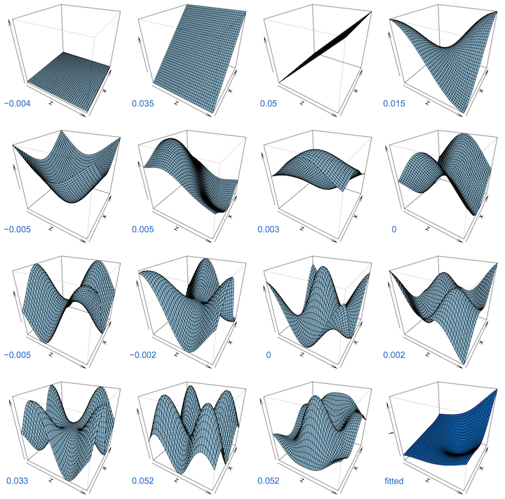
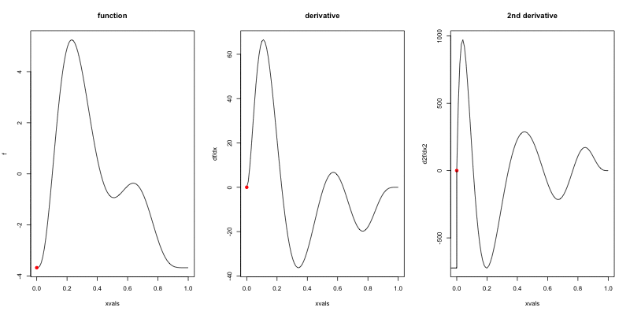

```{r setup, include=FALSE}
knitr::opts_chunk$set(comment=NA,
                      echo = FALSE, message = FALSE, warning = FALSE, cache = TRUE,
                      fig.align = 'center', fig.height = 4.5, fig.width = 8, dev = 'svg')
knitr::knit_hooks$set(crop.plot = knitr::hook_pdfcrop)
options(htmltools.dir.version = FALSE)
```
```{r packages, include = FALSE, cache = FALSE}
library('mgcv')
library('gamair')
library('ggplot2')
library('cowplot')
library('tidyr')
library("knitr")
library("viridis")
```
```{r ggplot-set-up, cache=FALSE}
theme_set(theme_minimal())
```

# Preamble

[https://github.com/gavinsimpson/gams-yorku-canada-150]()

---

# What are GAMs?

**G**eneralized **A**dditive **M**odel

* Generalized because they can handle response distibutions beyond the normal or Gaussian
    - **mgcv** can handle many types of data that lie even beyond traditional GLMs

* Additive &mdash; terms simply **add** together

* Model &mdash; a GAM has lots of theory for doing inference

---

# Linear Models

$$y_i ~ \mathcal{N}(\mu_i, \sigma^2)$$

$$\mu_i = \beta_0 + \beta_1 x_{1i} + \beta_2 x_{2i} + \cdots + \beta_j x_{ji}$$

Assumptions

* linear effects of covariates are good approximation of the true effects

* conditional on the values of covariates, $y_i | \mathbf{X} \sim \mathcal{N}(0, \sigma^2)$

* this implies all observations have the same *variance*

* $y_i | \mathbf{X}$ are *independent*

An **additive** model address the first of these

---
class: inverse center middle

# Why bother with anything more complex?

---

# Is this linear?

```{r islinear}
set.seed(2)
dat <- gamSim(1, n=400, dist="normal", scale=1, verbose=FALSE)
dat <- dat[,c("y", "x0", "x1", "x2", "x3")]
p <- ggplot(dat,aes(y=y,x=x1)) +
      geom_point()
p
```

---

# Is this linear? Maybe?

```{r eval=FALSE, echo=TRUE}
lm(y ~ x1, data=dat)
```


```{r maybe}
p <- ggplot(dat, aes(x = x1, y = y)) + geom_point() +
      theme_minimal()
p + geom_smooth(method="lm")
```

---
class: inverse center middle

# What can we do about it?

---

# Adding a quadratic term?

```{r eval=FALSE, echo=TRUE}
lm(y ~ poly(x1, 2), data = dat)
```

```{r quadratic}
p <- ggplot(dat, aes(y=y, x=x1)) + geom_point() +
      theme_minimal()
print(p + geom_smooth(method="lm", formula=y~x+poly(x, 2)))
```

---
class: inverse center middle

# What about real data?

---

# Small Water

What degree polynomial should we use here?

```{r small-water}
small <- readRDS('./data/small-water-isotope-data.rds')

d15n_label <- expression(delta^{15} * N) # y-axis label for plot
## data plot
small_plt <- ggplot(small, aes(x = Year, y = d15N)) +
    geom_point() +
    labs(y = d15n_label, x = "Year CE")
small_plt
```

---

# Polynomials

```{r polynomials, dependson = 'small-water'}
p <- c(1,3,5,10)         # order of polynomial
N <- 300                 # number of prediction points
## prediction data
newd <- with(small, data.frame(Year = seq(min(Year), max(Year), length = N)))
## function to fit linear models with polynomials
polyFun <- function(i, data = data) {
    lm(d15N ~ poly(Year, degree = i), data = data)
}
## fit models for polynomials p
mods <- lapply(p, polyFun, data = small)
## predict using each model
pred <- vapply(mods, predict, numeric(N), newdata = newd)
colnames(pred) <- p                     # add nice column names
newd <- cbind(newd, pred)               # combine
polyDat <- gather(newd, Degree, Fitted, - Year) # to long format
polyDat <- transform(polyDat, Degree = ordered(Degree, levels = p))

## add polynomial fits
polyPlt <- small_plt +
    geom_line(data = polyDat, mapping = aes(x = Year, y = Fitted, colour = Degree)) +
    scale_color_brewer(name = "Degree of polynomial:", palette = "PuOr") +
    theme(legend.position = "top")
polyPlt
```

---

# Is this sustainable?

Adding in quadratic (and higher terms) *can* make sense &mdash; feels a bit *ad hoc*

Better if we had a **framework** to deal with these issues?

```{r ruhroh}
p <- ggplot(dat, aes(y=y, x=x2)) + geom_point() +
      theme_minimal()
p + geom_smooth(method="lm", formula = y ~ poly(x, 2))
```

---
class: inverse center middle

# This is where GAMs are useful

---

# How is a GAM different?

In GLM we model the mean of data as a sum of linear terms:

$$y_i = \beta_0 +\sum_j \color{red}{ \beta_j x_{ji}} +\epsilon_i$$

A GAM is a sum of _smooth functions_ or _smooths_

$$y_i = \beta_0 + \sum_j \color{red}{s_j(x_{ji})} + \epsilon_i$$

where $\epsilon_i \sim N(0, \sigma^2)$, $y_i \sim \text{Normal}$ (for now)

Call the above equation the **linear predictor** in both cases.

---

# Fitting a GAM in R

```r
model <- gam(y ~ s(x1) + s(x2) + te(x3, x4), # formuala describing model
             data = my_data_frame,           # your data
             method = 'REML',                # or 'ML'
             family = gaussian)              # or something more exotic
```

`s()` terms are smooths of one or more variables

`te()` terms are the smooth equivalent of *main effects + interactions*

---
class: inverse center middle

# Your turn

---

# Load the Small Water data

```{r load-small-example, echo = TRUE}
small <- readRDS('./data/small-water-isotope-data.rds')
head(small)
```

---

# Fit the GAM

```{r fit-small-gam-example, echo = TRUE}
sw <- gam(d15N ~ s(Year), data = small, method = 'REML')
```

---

# Look at the model summary

.small[
```{r small-example-summary, echo = TRUE}
summary(sw)
```
]

---

# Plot the fitted smooth

```{r plot-small-example, echo = TRUE}
plot(sw, shade = TRUE, residuals = TRUE, pch = 19)
```

---
class: inverse
background-image: url('./resources/rob-potter-398564.jpg')
background-size: contain

# What magic is this?

.footnote[
<a style="background-color:black;color:white;text-decoration:none;padding:4px 6px;font-family:-apple-system, BlinkMacSystemFont, &quot;San Francisco&quot;, &quot;Helvetica Neue&quot;, Helvetica, Ubuntu, Roboto, Noto, &quot;Segoe UI&quot;, Arial, sans-serif;font-size:12px;font-weight:bold;line-height:1.2;display:inline-block;border-radius:3px;" href="https://unsplash.com/@robpotter?utm_medium=referral&amp;utm_campaign=photographer-credit&amp;utm_content=creditBadge" target="_blank" rel="noopener noreferrer" title="Download free do whatever you want high-resolution photos from Rob Potter"><span style="display:inline-block;padding:2px 3px;"><svg xmlns="http://www.w3.org/2000/svg" style="height:12px;width:auto;position:relative;vertical-align:middle;top:-1px;fill:white;" viewBox="0 0 32 32"><title></title><path d="M20.8 18.1c0 2.7-2.2 4.8-4.8 4.8s-4.8-2.1-4.8-4.8c0-2.7 2.2-4.8 4.8-4.8 2.7.1 4.8 2.2 4.8 4.8zm11.2-7.4v14.9c0 2.3-1.9 4.3-4.3 4.3h-23.4c-2.4 0-4.3-1.9-4.3-4.3v-15c0-2.3 1.9-4.3 4.3-4.3h3.7l.8-2.3c.4-1.1 1.7-2 2.9-2h8.6c1.2 0 2.5.9 2.9 2l.8 2.4h3.7c2.4 0 4.3 1.9 4.3 4.3zm-8.6 7.5c0-4.1-3.3-7.5-7.5-7.5-4.1 0-7.5 3.4-7.5 7.5s3.3 7.5 7.5 7.5c4.2-.1 7.5-3.4 7.5-7.5z"></path></svg></span><span style="display:inline-block;padding:2px 3px;">Rob Potter</span></a>
]

---


# Splines

Splines are *functions* composed of simpler functions

Simpler functions are *basis functions* & the set of basis functions is a *basis*

When we model using splines, each basis function $b_k$ has a coefficient $\beta_k$

Resultant spline is a the sum of these weighted basis functions, evaluated at the values of $x$

$$s(x) = \sum_{k = 1}^K \beta_k b_k(x)$$

---

# Basis functions

```{r basis-functions-1, dependson = 'small-water', fig.height = 4, fig.width = 10}
k <- 7
df <- with(small, data.frame(Year = seq(min(Year), max(Year), length = 200)))
knots <- with(small, list(Year = seq(min(Year), max(Year), length = k)))
sm <- smoothCon(s(Year, k = k, bs = "cr"), data = df, knots = knots)[[1]]$X
colnames(sm) <- levs <- paste0("F", seq_len(k))
basis <- gather(cbind(sm, df), Fun, Value, -Year)
basis <- transform(basis, Fun = factor(Fun, levels = levs))

sm2 <- smoothCon(s(Year, k = k, bs = "cr"), data = small, knots = knots)[[1]]$X
beta <- coef(lm(d15N ~ sm2 - 1, data = small))
scbasis <- sweep(sm, 2L, beta, FUN = "*")
colnames(scbasis) <- levs <- paste0("F", seq_len(k))
fit <- cbind(df, fitted = rowSums(scbasis))
scbasis <- gather(cbind(scbasis, df), Fun, Value, -Year)
scbasis <- transform(scbasis, Fun = factor(Fun, levels = levs))

ylims <- range(basis$Value, scbasis$Value, small$d15N)

p1 <- ggplot(basis, aes(x = Year, y = Value, group = Fun, colour = Fun)) +
    geom_path() +
    scale_x_continuous(breaks = knots$Year, labels = NULL, minor_breaks = NULL) +
    scale_y_continuous(limits = ylims) +
    scale_colour_discrete(name = "Basis Function") +
    theme(legend.position = "none") +
    geom_point(data = small, mapping = aes(x = Year, y = d15N), inherit.aes = FALSE, size = 2, colour = "grey70") +
    labs(y = d15n_label, x = "Year CE (Knots)")

p2 <- ggplot(scbasis, aes(x = Year, y = Value, group = Fun, colour = Fun)) +
    geom_path() +
    scale_x_continuous(breaks = knots$Year, labels = NULL, minor_breaks = NULL) +
    scale_y_continuous(limits = ylims) +
    scale_colour_discrete(name = "Basis Function") +
    theme(legend.position = "none") +
    geom_point(data = small, mapping = aes(x = Year, y = d15N), inherit.aes = FALSE, size = 2, colour = "grey70") +
    geom_line(data = fit, mapping = aes(x = Year, y = fitted), inherit.aes = FALSE,
              size = 0.75, colour = "black") +
    labs(y = d15n_label, x = "Year CE (Knots)")

pbasis <- plot_grid(p1, p2, ncol = 2, align = "hv", labels = "auto")
pbasis
```

---

# Basis functions

.center[]

---
class: inverse center middle

# How do we avoid overfitting?

---

# Avoiding overfitting

.pull-left[
```{r wiggles, fig.height=3, fig.width=5}
# hacked from the example in ?gam
set.seed(2) ## simulate some data... 
dat <- gamSim(1,n=50,dist="normal",scale=0.5, verbose=FALSE)
dat$y <- dat$f2 + rnorm(length(dat$f2), sd = sqrt(0.5))
f2 <- function(x) 0.2*x^11*(10*(1-x))^6+10*(10*x)^3*(1-x)^10-mean(dat$y)
ylim <- c(-4,6)

# fit some models
b.justright <- gam(y~ s(x2), data=dat)
b.sp0 <- gam(y ~ s(x2, sp=0, k=50), data = dat)
b.spinf <- gam(y ~ s(x2), data=dat, sp = 1e10)

df <- data.frame(x2 = seq(0, 1, length = 100))
df <- transform(df, f = f2(x2))
dat <- transform(dat, ycent = y - mean(y))
ggplot(df, aes(x = x2, y = f)) +
    geom_line(colour = 'blue') +
    geom_point(data = dat, aes(x = x2, y = ycent)) +
    labs(x = 'x', y = 'y')
```
]

.pull-right[
* Want a line that is *close* to all the data (high likelihood)

* Splines *could* just fit every data point, but this would be overfitting.  We know there is *error*

* Easy to overfit &mdash; *smooth* curve.

* How do we measure smoothness? Calculus!
]

---

# Measuring wiggliness

.center[

]

---

# What was that grey bit? Wigglyness

$$\int_\mathbb{R} \left( \frac{\partial^2 f(x)}{\partial^2 x}\right)^2 \text{d}x = \boldsymbol{\beta}^\text{T}S\boldsymbol{\beta} = \large{W}$$

(Wigglyness is 100% the right mathy word)

We penalize wiggliness to avoid overfitting

---

# Making wigglyness matter

$W$ measures **wigglyness**

(log) likelihood measures closeness to the data

We use a **smoothing parameter** $\lambda$ to define the trade-off, to find
the spline coefficients $B_k$ that maximize the **penalized** log-likelihood

$$\mathcal{L}_p = \log(\text{Likelihood})  - \lambda W$$

---

# Picking the right wiggliness

```{r wiggles-plot, fig.width = 11, fig.height = 4}
# make three plots, w. estimated smooth, truth and data on each
op <- par(mfrow=c(1,3), cex.main = 2.5)

plot(b.justright, se=FALSE, ylim=ylim, main=expression(lambda~plain("= just right")))
points(dat$x2, dat$y-mean(dat$y))
curve(f2,0,1, col="blue", add=TRUE)

plot(b.sp0, se=FALSE, ylim=ylim, main=expression(lambda~plain("=")~0))
points(dat$x2, dat$y-mean(dat$y))
curve(f2,0,1, col="blue", add=TRUE)

plot(b.spinf, se=FALSE, ylim=ylim, main=expression(lambda~plain("=")~infinity)) 
points(dat$x2, dat$y-mean(dat$y))
curve(f2,0,1, col="blue", add=TRUE)
par(op)
```

---

# Picking the right wiggliness

.pull-left[
Two ways to think about how to optimize $\lambda$:

* Predictive: Minimize out-of-sample error

* Bayesian:  Put priors on our basis coefficients
]

.pull-right[
Many methods: AIC, Mallow's $C_p$, GCV, ML, REML

* **Practically**, use **REML**, because of numerical stability

* Hence `gam(..., method="REML")`
]

.center[

]

---

# Maximum wiggliness

We set **basis complexity** or "size" $k$

This is _maximum wigglyness_, can be thought of as number of small functions that make up a curve

Once smoothing is applied, curves have fewer **effective degrees of freedom (EDF)**

EDF < $k$

$k$ must be *large enough*, the $\lambda$ penalty does the rest

*Large enough* &mdash; space of functions representable by the basis includes the true function or a close approximation to the tru function

Bigger $k$ increases computational cost

In **mgcv**, default $k$ values are arbitrary &mdash; after choosing the model terms, this is the key user choice

**Must be checked!** &mdash; `gam.check()`

---

# GAM summary so far

1. GAMs give us a framework to model  flexible nonlinear relationships

2. Use little functions (**basis functions**) to make big functions (**smooths**)

3. Use a **penalty** to trade off wiggliness/generality 

4. Need to make sure your smooths are **wiggly enough**

---

# Portugese larks

.pull-left[

```{r birds-1, echo = TRUE}
library('gamair')
data(bird)

bird <- transform(bird,
            crestlark = factor(crestlark),
            linnet = factor(linnet),
            e = x / 1000,
            n = y / 1000)
head(bird)
```
]

.pull-right[

```{r birds-2, fig.width = 4, fig.height = 5}
ggplot(bird, aes(x = e, y = n, colour = crestlark)) + geom_point(size = 0.5) + coord_fixed() + scale_colour_discrete(na.value = '#bbbbbb33') + labs(x = NULL, y = NULL)
```
]

---
 
# Portugese larks &mdash; binomial GAM

.pull-left[
```{r birds-gam-1, echo = TRUE}
crest <- gam(crestlark ~ s(e, n, k = 100),
             data = bird,
             family = binomial,
             method = 'REML')
```

$s(e, n)$ indicated by `s(e, n)` in the formula

Isotropic thin plate spline

`k` sets size of basis dimension; upper limit on EDF

Smoothness parameters estimated via REML
]

.pull-right[
.small[
```{r birds-gam-2, echo = TRUE}
summary(crest)
```
]
]

---

# Portugese larks &mdash; binomial GAM

Model checking with binary data is a pain &mdash; residuals look weird

Alternatively we can aggregate data at the `QUADRICULA` level & fit a binomial count model

.small[
```{r munge-larks, echo = TRUE}
## convert back to numeric
bird <- transform(bird,
                  crestlark = as.numeric(as.character(crestlark)),
                  linnet = as.numeric(as.character(linnet)))
## some variables to help aggregation
bird <- transform(bird, tet.n = rep(1, nrow(bird)),
                  N = rep(1, nrow(bird)), stringsAsFactors = FALSE)
## set to NA if not surveyed
bird$N[is.na(as.vector(bird$crestlark))] <- NA
## aggregate
bird2 <- aggregate(data.matrix(bird), by = list(bird$QUADRICULA),
                   FUN = sum, na.rm = TRUE)
## scale by Quads aggregated
bird2 <- transform(bird2, e = e / tet.n, n = n / tet.n)

## fit binomial GAM
crest2 <- gam(cbind(crestlark, N - crestlark) ~ s(e, n, k = 100),
              data = bird2, family = binomial, method = 'REML')
```
]

---

# Model checking

.pull-left[
Model residuals don't look too bad

Bands of points due to integers

.small[
```{r crest-3, echo = TRUE}
crest3 <- gam(cbind(crestlark, N - crestlark) ~
                  s(e, n, k = 100),
              data = bird2, family = quasibinomial,
              method = 'REML')
```
]

Some overdispersion &mdash; &phi; = `r round(crest3$scale,2)`
]

.pull-right[
```{r gam-check-aggregated-lark, echo = TRUE, fig.width = 4.5, fig.height = 4}
ggplot(data.frame(Fitted = fitted(crest2),
                  Resid = resid(crest2)),
       aes(Fitted, Resid)) + geom_point() 
```
]

---
class: inverse center middle

# Model checking

---

# Model checking

So you have a GAM:

- How do you know you have the right degrees of freedom? `gam.check()`

- Diagnosing model issues: `gam.check()` part 2

---

# GAMs are models too

With all models, how accurate your predictions will be depends on how good the model is

```{r misspecify, fig.width = 11, fig.height = 5}
set.seed(15)
model_list = c("right model", 
               "wrong distribution",
               "heteroskedasticity",
               "dependent data",
               "wrong functional form")
n <- 60
sigma=1
x <- seq(-1,1, length=n)
model_data <- as.data.frame(expand.grid( x=x,model=model_list))
model_data$y <- 5*model_data$x^2 + 2*model_data$x
for(i in model_list){
  if(i == "right model"){
    model_data[model_data$model==i, "y"] <- model_data[model_data$model==i, "y"]+ 
      rnorm(n,0, sigma)
  } else if(i == "wrong distribution"){
    model_data[model_data$model==i, "y"] <- model_data[model_data$model==i, "y"]+ 
      rt(n,df = 3)*sigma
  } else if(i == "heteroskedasticity"){
    model_data[model_data$model==i, "y"] <- model_data[model_data$model==i, "y"]+  
      rnorm(n,0, sigma*10^(model_data[model_data$model==i, "x"]))
  } else if(i == "dependent data"){
    model_data[model_data$model==i, "y"] <- model_data[model_data$model==i, "y"]+ 
      arima.sim(model = list(ar=c(.7)), n = n,sd=sigma) 
  } else if(i=="wrong functional form") {
    model_data[model_data$model==i, "y"] <- model_data[model_data$model==i, "y"]+ 
      rnorm(n,0, sigma) + ifelse(model_data[model_data$model==i, "x"]>0, 5,-5)
  }
}
ggplot(aes(x,y), data= model_data)+
  geom_point()+
  geom_line(color=ifelse(model_data$model=="dependent data", "black",NA))+
  facet_wrap(~model)+
  geom_smooth(method=gam, formula = y~s(x,k=12),method.args = list(method="REML"))+
  theme(strip.text = element_text(size=16))
```

---
class: inverse center middle

# How do we test how well our model fits?

---

# Examples

```{r sims, include=TRUE,echo=TRUE}
set.seed(2)
n <- 400
x1 <- rnorm(n)
x2 <- rnorm(n)
y_val <- 1 + 2*cos(pi*x1) + 2/(1+exp(-5*(x2)))
y_norm <- y_val + rnorm(n, 0, 0.5)
y_negbinom <- rnbinom(n, mu = exp(y_val),size=10)
y_binom <- rbinom(n,1,prob = exp(y_val)/(1+exp(y_val)))
```

---

# Examples

```{r sims_plot,fig.width = 11, fig.height = 5.5}
layout(matrix(1:6, ncol=3))
op <- par(mar = c(5,5,1,1) + 0.1)
plot(x1,y_norm,cex.lab=2,cex.axis=2)
plot(x2,y_norm,cex.lab=2,cex.axis=2)
plot(x1,y_negbinom,cex.lab=2,cex.axis=2)
plot(x2,y_negbinom,cex.lab=2,cex.axis=2)
plot(x1,y_binom,cex.lab=2,cex.axis=2)
plot(x2,y_binom,cex.lab=2,cex.axis=2)
par(op)
layout(1)
```

---
class: inverse middle center

# gam.check() part 1: do you have the right functional form?

---

# How well does the model fit?

- Many choices: k, family, type of smoother, &hellip;

- How do we assess how well our model fits?

---

# Basis size *k*

- Set `k` per term

- e.g. `s(x, k=10)` or `s(x, y, k=100)`

- Penalty removes "extra" wigglyness
    
	- *up to a point!*

- (But computation is slower with bigger `k`)

---

# Checking basis size

```{r gam_check_norm1, fig.keep="none", include=TRUE,echo=TRUE, fig.width=11, fig.height = 5.5, fig.align="center"}
norm_model_1 = gam(y_norm~s(x1,k=4)+s(x2,k=4),method= "REML")
gam.check(norm_model_1)
```

---

# Checking basis size

```{r gam_check_norm2, fig.keep="none", include=TRUE,echo=TRUE, fig.width=15, fig.height = 5.5,fig.align="center"}
norm_model_2 = gam(y_norm~s(x1,k=12)+s(x2,k=4),method= "REML")
gam.check(norm_model_2)
```

---

# Checking basis size

```{r gam_check_norm3, fig.keep="none", include=TRUE,echo=TRUE, fig.width=15,fig.align="center"}
norm_model_3 = gam(y_norm~s(x1,k=12)+s(x2,k=12),method= "REML")
gam.check(norm_model_3)
```

---

# Checking basis size

```{r gam_check_norm4, fig.width = 11, fig.height = 5.5}
layout(matrix(1:6,ncol=2,byrow = T))
op <- par(mar = c(5,5,1,1) + 0.1)
plot(norm_model_1, shade = TRUE)
plot(norm_model_2, shade = TRUE)
plot(norm_model_3, shade = TRUE)
par(op)
layout(1)
```

---
class: inverse middle center

# Using gam.check() part 2: visual checks

---

# gam.check() plots

`gam.check()` creates 4 plots: 

1. Quantile-quantile plots of residuals. If the model is right, should follow 1-1 line

2. Histogram of residuals

3. Residuals vs. linear predictor

4. Observed vs. fitted values

`gam.check()` uses deviance residuals by default

---

# gam.check() plots: Gaussian data, Gaussian model


```{r gam_check_plots1, include=TRUE, echo=TRUE, results="hide", fig.width=9, fig.height=5}
norm_model <- gam(y_norm ~ s(x1, k=12) + s(x2, k=12), method = 'REML')
gam.check(norm_model)
```

---

# gam.check() plots: negative binomial data, Poisson model


```{r gam_check_plots2, include=T,echo=TRUE, results="hide", fig.width=9, fig.height=5}
pois_model <- gam(y_negbinom ~ s(x1, k=12) + s(x2, k=12), family=poisson, method= 'REML')
gam.check(pois_model)
```

---

# gam.check() plots: neg binomial data, neg binomial model


```{r gam_check_plots3, include=T,echo=TRUE, results="hide", fig.width=9, fig.height=5}
negbin_model <- gam(y_negbinom ~ s(x1, k=12) + s(x2, k=12), family = nb, method = 'REML')
gam.check(negbin_model)
```

---
class: inverse center middle

# Model selection

---

# Model selection

Model (or variable) selection &mdash; an important area of theoretical and applied interest

- In statistics we aim for a balance between *fit* and *parsimony*

- In applied research we seek the set of covariates with strongest effects on $y$

We seek a subset of covariates that improves *interpretability* and *prediction accuracy*

---
class: inverse center middle

# Shrinkage & additional penalties

---

# Shrinkage & additional penalties

Smoothing parameter estimation allows selection of a wide range of potentially complex functions for smooths...

But, cannot remove a term entirely from the model because the penalties used act only on the *range space* of a spline basis. The *null space* of the basis is unpenalised.

- **Null space** &mdash; the basis functions that are smooth (constant, linear)

- **Range space** &mdash; the basis functions that are wiggly

---

# Shrinkage & additional penalties

**mgcv** has two ways to penalize the null space, i.e. to do selection

- *double penalty approach* via `select = TRUE`

- *shrinkage approach* via special bases for
    
	- thin plate spline (default, `s(..., bs = 'ts')`),
    
	- cubic splines  (`s(..., bs = 'cs')`)

**double penalty** tends to works best, but applies to all smooths *and* doubles the number of smoothness parameters to estimate

Other shrinkage/selection approaches *are available* in other software

<!-- Double-penalty shrinkage -->
<!-- ======================== -->

<!-- $\mathbf{S}_j$ is the smoothing penalty matrix & can be decomposed as -->

<!-- $$ -->
<!-- \mathbf{S}_j = \mathbf{U}_j\mathbf{\Lambda}_j\mathbf{U}_j^{T} -->
<!-- $$ -->

<!-- where $\mathbf{U}_j$ is a matrix of eigenvectors and $\mathbf{\Lambda}_j$ a diagonal matrix of eigenvalues (i.e. this is an eigen decomposition of $\mathbf{S}_j$). -->

<!-- $\mathbf{\Lambda}_j$ contains some **0**s due to the spline basis null space &mdash; no matter how large the penalty $\lambda_j$ might get no guarantee a smooth term will be suppressed completely. -->

<!-- To solve this we need an extra penalty... -->

<!-- Double-penalty shrinkage -->
<!-- ======================== -->

<!-- Create a second penalty matrix from $\mathbf{U}_j$, considering only the matrix of eigenvectors associated with the zero eigenvalues -->

<!-- $$ -->
<!-- \mathbf{S}_j^{*} = \mathbf{U}_j^{*}\mathbf{U}_j^{*T} -->
<!-- $$ -->

<!-- Now we can fit a GAM with two penalties of the form -->

<!-- $$ -->
<!-- \lambda_j \mathbf{\beta}^T \mathbf{S}_j \mathbf{\beta} + \lambda_j^{*} \mathbf{\beta}^T \mathbf{S}_j^{*} \mathbf{\beta} -->
<!-- $$ -->

<!-- Which implies two sets of penalties need to be estimated. -->

<!-- In practice, add `select = TRUE` to your `gam()` call -->

<!-- Shrinkage -->
<!-- ========= -->

<!-- The double penalty approach requires twice as many smoothness parameters to be estimated. An alternative is the shrinkage approach, where $\mathbf{S}_j$ is replaced by -->


<!-- $$ -->
<!-- \tilde{\mathbf{S}}_j = \mathbf{U}_j\tilde{\mathbf{\Lambda}}_j\mathbf{U}_j^{T} -->
<!-- $$ -->

<!-- where $\tilde{\mathbf{\Lambda}}_j$ is as before except the zero eigenvalues are set to some small value $\epsilon$. -->

<!-- This allows the null space terms to be shrunk by the standard smoothing parameters. -->

<!-- Use `s(..., bs = "ts")` or `s(..., bs = "cs")` in **mgcv** -->

---

# Empirical Bayes...?

$\mathbf{S}_j$ can be viewed as prior precision matrices and $\lambda_j$ as improper Gaussian priors on the spline coefficients.

The impropriety derives from $\mathbf{S}_j$ not being of full rank (zeroes in $\mathbf{\Lambda}_j$).

Both the double penalty and shrinkage smooths remove the impropriety from the Gaussian prior

---
# Empirical Bayes...?

- **Double penalty** &mdash; makes no assumption as to how much to shrink the null space. This is determined from the data via estimation of $\lambda_j^{*}$

- **Shrinkage smooths** &mdash; assumes null space should be shrunk less than the wiggly part

Marra & Wood (2011) show that the double penalty and the shrinkage smooth approaches

- performed significantly better than alternatives in terms of *predictive ability*, and

- performed as well as alternatives in terms of variable selection

---

# Example

.pull-left[
- Simulate Poisson counts

- 4 known functions (left)

- 2 spurious covariates (`runif()` & not shown)

```{r setup-shrinkage-example, echo = FALSE, include = FALSE}
## an example of automatic model selection via null space penalization
set.seed(3)
n <- 200
dat <- gamSim(1, n=n, scale=.15, dist='poisson')                ## simulate data
dat <- transform(dat, x4 = runif(n, 0, 1), x5 = runif(n, 0, 1)) ## spurious
```
```{r shrinkage-example-model-fit, echo = TRUE}
b <- gam(y ~ s(x0) + s(x1) + s(x2) + s(x3) +
             s(x4) + s(x5),
         data = dat,
         family = poisson,
         select = TRUE, method = 'REML')
```
]

.pull-right[
```{r shrinkage-example-truth, fig.height = 6}
p1 <- ggplot(dat, aes(x = x0, y = f0)) + geom_line()
p2 <- ggplot(dat, aes(x = x1, y = f1)) + geom_line()
p3 <- ggplot(dat, aes(x = x2, y = f2)) + geom_line()
p4 <- ggplot(dat, aes(x = x3, y = f3)) + geom_line()
plot_grid(p1, p2, p3, p4, ncol = 2, align = 'vh', labels = paste0('x', 1:4))
```
]

---

# Example

.small[.pull-left[
```{r shrinkage-example-summary}
summary(b)
```
]]

.pull-right[
```{r shrinkage-example-truth-2, fig.height = 6}
plot_grid(p1, p2, p3, p4, ncol = 2, align = 'vh', labels = paste0('x', 1:4))
```
]

---

# Example

```{r shrinkage-example-plot, fig.width = 11, fig.height = 5.5}
op <- par(mar = c(5,4,1,1) + 0.1)
plot(b, scheme = 1, pages = 1)
par(op)
```

---
class: inverse center middle

# Confidence intervals for smooths

---

# Confidence intervals for smooths

`plot.gam()` produces approximate 95% intervals (at +/- 2 SEs)

What do these intervals represent?

Nychka (1988) showed that standard Wahba/Silverman type Bayesian confidence intervals on smooths had good **across-the-function** frequentist coverage properties

When *averaged* over the range of covariate, 1 - &alpha; coverage is approximately 1 - &alpha;

---

# Confidence intervals for smooths

Marra & Wood (2012) extended this theory to the generalised case and explain where the coverage properties failed:

*Musn't over-smooth too much, which happens when $\lambda_j$ are over-estimated*

Two situations where this might occur

1. where true effect is almost in the penalty null space, $\hat{\lambda}_j \rightarrow \infty$
    
	- ie. close to a linear function

2. where $\hat{\lambda}_j$ difficult to estimate due to highly correlated covariates
    
	- if 2 correlated covariates have different amounts of wiggliness, estimated effects can have degree of smoothness *reversed*

---

# Don't over-smooth

> In summary, we have shown that Bayesian componentwise variable width intervals... for the smooth components of an additive model **should achieve close to nominal *across-the-function* coverage probability**, provided only that we do not over-smooth so heavily... Beyond this  requirement not to oversmooth too heavily, the results appear to have rather weak dependence on smoothing parameter values, suggesting that the neglect of smoothing parameter  variability  should  not  significantly  degrade  interval  performance.

Basically

1. Don't over smooth, and

2. Effect of uncertainty due to estimating smoothness parameter is small

---

# Confidence intervals for smooths

Marra & Wood (2012) suggested a solution to situation 1., namely true functions close to the penalty null space.

Smooths are normally subject to *identifiability* constraints (centred), which leads to zero variance where the estimated function crosses the zero line.

Instead, compute intervals for $j$ th smooth as if it alone had the intercept; identifiability constraints go on the other smooth terms.

Use `seWithMean = TRUE` in call to `plot.gam()`

---

# Example

```{r setup-confint-example, fig = TRUE, fig.width = 11, fig.height = 5.5, results = "hide"}
library(mgcv)
set.seed(0)
## fake some data...
f1 <- function(x) {exp(2 * x)}
f2 <- function(x) { 
  0.2*x^11*(10*(1-x))^6+10*(10*x)^3*(1-x)^10 
}
f3 <- function(x) {x*0}

n<-200
sig2 <- 12
x0 <- rep(1:4,50)
x1 <- runif(n, 0, 1)
x2 <- runif(n, 0, 1)
x3 <- runif(n, 0, 1)
e <- rnorm(n, 0, sqrt(sig2))
y <- 2*x0 + f1(x1) + f2(x2) + f3(x3) + e
x0 <- factor(x0)

## fit and plot...
b <- gam(y ~ x0 + s(x1) + s(x2) + s(x3))

op <- par(mar = c(4,4,1,1) + 0.1)
layout(matrix(1:9, ncol = 3, byrow = TRUE))
curve(f1)
curve(f2)
curve(f3)
plot(b, shade=TRUE)
plot(b, shade = TRUE, seWithMean = TRUE) ## better coverage intervals
layout(1)
par(op)
```

---
class: inverse center middle

# *p* values for smooths

---

# *p* values for smooths

*p* values for smooths are approximate:

1. they don't account for the estimation of $\lambda_j$ &mdash; treated as known, hence *p* values are biased low

2. rely on asymptotic behaviour &mdash; they tend towards being right as sample size tends to $\infty$

The approach described in Wood (2006) is "*no longer recommended*"!

---

# *p* values for smooths

...are a test of **zero-effect** of a smooth term

Default *p* values rely on theory of Nychka (1988) and Marra & Wood (2012) for confidence interval coverage

If the Bayesian CI have good across-the-function properties, Wood (2013a) showed that the *p* values have

- almost the correct null distribution

- reasonable power

Test statistic is a form of $\chi^2$ statistic, but with complicated degrees of freedom

---

# *p* values for unpenalized smooths

The results of Nychka (1988) and Marra & Wood (2012) break down if smooth terms are unpenalized

This include i.i.d. Gaussian random effects, (e.g. `bs = "re"`)

Wood (2013b) proposed instead a test based on a likelihood ratio statistic:

- the reference distribution used is appropriate for testing a $\mathrm{H}_0$ on the boundary of the allowed parameter space...

- ...in other words, it corrects for a $\mathrm{H}_0$ that a variance term is zero

---

# *p* values for smooths

Have the best behaviour when smoothness selection is done using **ML**, then **REML**.

Neither of these are the default, so remember to use `method = "ML"` or `method = "REML"` as appropriate

---

# *p* values for parametric terms

*p* values are based on Wald statistics using the Bayesian covariance matrix for the coefficients.

This is the *right thing to do* when there are random effects terms present and doesn't really affect performance if there aren't.

Hence in most instances you won't need to change the default `freq = FALSE` in `summary.gam()`

---

# anova()

**mgcv** provides an `anova()` method for `"gam"` objects:

1. Single model form: `anova(m1)`

2. Multi model form: `anova(m1, m2, m3)`

---

# anova() &mdash; single model form

.pull-left[
This differs from `anova()` methods for `"lm"` or `"glm"` objects:

* the tests are Wald-like tests as described for `summary.gam()` of a $\mathrm{H}_0$ of zero-effect of a smooth term

* these are not *sequential* tests!
]

.pull-right[
```{r anova-example-single, echo = TRUE}
b1 <- gam(y ~ x0 + s(x1) + s(x2) + s(x3),
          method = "REML")
anova(b1)
```
]

---

# anova() &mdash; multi model form

The multi-model form should really be used with care &mdash; the *p* values are really *approximate*

```{r anova-example-multi, echo = TRUE}
b1 <- gam(y ~ s(x0) + s(x1) + s(x2) + s(x3) + s(x4) + s(x5),
          data = dat, family=poisson, method = "ML")
b2 <- update(b1, . ~ . - s(x3) - s(x4) - s(x5))
anova(b2, b1, test = "Chisq")
```

*Don't used for testing random effect splines!*

For *general smooths* deviance is replaced by $-2\mathcal{L}(\hat{\beta})$

---

# AIC for GAMs

- Comparison of GAMs by a form of AIC is an alternative frequentist approach to model selection

- Rather than using the marginal likelihood, the likelihood of the $\mathbf{\beta}_j$ *conditional* upon $\lambda_j$ is used, with the EDF replacing $k$, the number of model parameters

- This *conditional* AIC tends to select complex models, especially those with random effects, as the EDF ignores that $\lambda_j$ are estimated

- Wood et al (2016) suggests a correction that accounts for uncertainty in $\lambda_j$

$$AIC = -2\mathcal{L}(\hat{\beta}) + 2\mathrm{tr}(\widehat{\mathcal{I}}V^{'}_{\beta})$$

---

# AIC

In this example, $x_3$, $x_4$, and $x_5$ have no effects on $y$

```{r aic-example, echo = TRUE}
AIC(b1, b2)
```

When there is *no difference* in compared models, accepts larger model ~16% of the time: consistent with probability AIC chooses a model with 1 extra spurious parameter $Pr(\chi^2_1 > 2)$

```{r aic-chisq, echo = TRUE}
pchisq(2, 1, lower.tail = FALSE)
```

---

# Atmospheric CO<sub>2</sub>

```{r co2-example-1, echo = TRUE}
data(co2s)
head(co2s)
```

---

# Atmospheric CO<sub>2</sub>

```{r co2-example-2, echo = TRUE}
ggplot(co2s, aes(x = c.month, y = co2)) +
    geom_line()
```

---

# Atmospheric CO<sub>2</sub> &mdash; fit naive GAM

.small[
```{r co2-example-3, echo = TRUE}
b <- gam(co2 ~ s(c.month, k=300, bs="cr"), data = co2s, method = 'REML')
summary(b)
```
]

---

# Atmospheric CO<sub>2</sub> &mdash; predict

```{r co2-example-4, echo = TRUE}
pd <- with(co2s, data.frame(c.month = 1:(nrow(co2s)+36)))
pd <- cbind(pd, predict(b, pd, se = TRUE))
pd <- transform(pd, upr = fit + (2*se.fit), lwr = fit - (2 * se.fit))
```

---

# Atmospheric CO<sub>2</sub> &mdash; predict

```{r co2-example-5, echo = TRUE, fig.height = 4}
ggplot(pd, aes(x = c.month, y = fit)) +
    geom_ribbon(aes(ymin = lwr, ymax = upr), alpha = 0.2) +
    geom_line(data = co2s, aes(c.month, co2), col = 'red') +
    geom_line(alpha = 0.5)
```

---

# Atmospheric CO<sub>2</sub> &mdash; better model

```{r co2-example-6, echo = TRUE}
b2 <- gam(co2 ~ s(month, bs="cc") + s(c.month, bs ="cr", k = 300),
          data = co2s, method = 'REML',
          knots = list(month=seq(1,13,length=10)))
```

---

# Atmospheric CO<sub>2</sub> &mdash; better model

.small[
```{r co2-example-7, echo = TRUE}
summary(b2)
```
]

---

# Atmospheric CO<sub>2</sub> &mdash; predict

```{r co2-example-8, echo = TRUE}
nr <- nrow(co2s)
pd2 <- with(co2s, data.frame(c.month = 1:(nr+36),
                             month = rep(1:12, length.out=nr+36)))
pd2 <- cbind(pd2, predict(b2, pd2, se = TRUE))
pd2 <- transform(pd2, upr = fit + (2*se.fit), lwr = fit - (2 * se.fit))
```

---

# Atmospheric CO<sub>2</sub> &mdash; predict

```{r co2-example-9, echo = TRUE, fig.height = 4}
ggplot(pd2, aes(x = c.month, y = fit)) +
    geom_ribbon(aes(ymin = lwr, ymax = upr), alpha = 0.2) +
    geom_line(data = co2s, aes(c.month, co2), col = 'red') +
    geom_line(alpha = 0.5)
```

---

# Next steps

Read Simon Wood's book

Tonnes more material on our ESA GAM Workshop site

[https://noamross.github.io/mgcv-esa-workshop/]()

Also see my blog: [www.fromthebottomoftheheap.net](http://www.fromthebottomoftheheap.net)

---

# References

- [Marra & Wood (2011) *Computational Statistics and Data Analysis* **55** 2372--2387.](http://doi.org/10.1016/j.csda.2011.02.004)
- [Marra & Wood (2012) *Scandinavian Journal of Statistics, Theory and Applications* **39**(1), 53--74.](http://doi.org/10.1111/j.1467-9469.2011.00760.x.)
- [Nychka (1988) *Journal of the American Statistical Association* **83**(404) 1134--1143.](http://doi.org/10.1080/01621459.1988.10478711)
- Wood (2006, 2017) *Generalized Additive Models: An Introduction with R*. Chapman and Hall/CRC. (New 2nd Edition)
- [Wood (2013a) *Biometrika* **100**(1) 221--228.](http://doi.org/10.1093/biomet/ass048)
- [Wood (2013b) *Biometrika* **100**(4) 1005--1010.](http://doi.org/10.1093/biomet/ast038)
- [Wood et al (2016) *JASA* **111** 1548--1563](https://doi.org/10.1080/01621459.2016.1180986)
